# 📊 Experimental Results Analysis

**Auto-generated summary of all Binary Neural Network experiments**

Total experiments analyzed: **19**

---

## 🏆 Top Performers

| Rank | Loss Function | Hyperparameters | Best Acc | Epochs | Time/Epoch |
|------|---------------|-----------------|----------|--------|------------|
| 🥇 | Vlog + β-Annealing | b=5.0, β: 0.5 -> 5.0 | **97.59%** | 20 | 15.9s |
| 🥈 | Vlog (Fixed) | b=2.0, β=1.0 | **97.57%** | 10 | 15.8s |
| 🥉 | Vlog + β-Annealing | b=5.0, β: 0.5 -> 100.0 | **97.28%** | 20 | 15.7s |
| 4. | Vlog (Fixed) | b=1.0, β=1.0 | **97.24%** | 10 | 15.7s |
| 5. | Hinge + β-Annealing | margin=1.0, β: 0.5 -> 5.0 | **97.05%** | 20 | 16.5s |
| 6. | Hinge Loss | margin=1.0 | **96.86%** | 20 | 16.2s |
| 7. | Vlog + β-Annealing | b=5.0, β: 0.5 -> 100.0 | **96.74%** | 10 | 15.9s |
| 8. | Vlog + β-Annealing | b=5.0, β: 0.5 -> 5.0 | **96.70%** | 10 | 15.4s |
| 9. | Cross-Entropy | — | **96.19%** | 10 | 13.8s |
| 10. | Vlog (Fixed) | b=5.0, β=1.0 | **96.06%** | 10 | 16.1s |

---

## 📈 Detailed Results by Configuration

### CE - 10 Epochs

| Configuration | Best Test Acc | Final Test Acc | Training Time | Status |
|---------------|---------------|----------------|---------------|--------|
| — | 96.19% | 96.12% | 138.2s (2.30 min) | ✅ Success |
| — | 95.64% | 95.64% | 148.7s (2.48 min) | ✅ Success |

### HINGE - 10 Epochs

| Configuration | Best Test Acc | Final Test Acc | Training Time | Status |
|---------------|---------------|----------------|---------------|--------|
| margin=1.0 | 94.16% | 94.16% | 168.0s (2.80 min) | ✅ Success |

### HINGE - 20 Epochs

| Configuration | Best Test Acc | Final Test Acc | Training Time | Status |
|---------------|---------------|----------------|---------------|--------|
| margin=1.0 | 96.86% | 96.79% | 324.9s (5.42 min) | ✅ Success |

### HINGE B ANNEALING - 10 Epochs

| Configuration | Best Test Acc | Final Test Acc | Training Time | Status |
|---------------|---------------|----------------|---------------|--------|
| margin=1.0, b: 1.0 -> 100.0 | 77.11% | 9.80% | 165.6s (2.76 min) | ❌ Failed |

### HINGE B ANNEALING - 20 Epochs

| Configuration | Best Test Acc | Final Test Acc | Training Time | Status |
|---------------|---------------|----------------|---------------|--------|
| margin=1.0, b: 1.0 -> 100.0 | 87.01% | 9.80% | 322.9s (5.38 min) | ❌ Failed |

### HINGE BETA ANNEALING - 10 Epochs

| Configuration | Best Test Acc | Final Test Acc | Training Time | Status |
|---------------|---------------|----------------|---------------|--------|
| margin=1.0, β: 0.5 -> 5.0 | 95.83% | 95.48% | 169.0s (2.82 min) | ✅ Success |

### HINGE BETA ANNEALING - 20 Epochs

| Configuration | Best Test Acc | Final Test Acc | Training Time | Status |
|---------------|---------------|----------------|---------------|--------|
| margin=1.0, β: 0.5 -> 5.0 | 97.05% | 96.26% | 331.0s (5.52 min) | ✅ Success |

### HINGE BOTH ANNEALING - 10 Epochs

| Configuration | Best Test Acc | Final Test Acc | Training Time | Status |
|---------------|---------------|----------------|---------------|--------|
| margin=1.0, b: 1.0 -> 100.0, β: 0.5 -> 5.0 | 79.90% | 9.80% | 165.9s (2.77 min) | ❌ Failed |

### HINGE BOTH ANNEALING - 20 Epochs

| Configuration | Best Test Acc | Final Test Acc | Training Time | Status |
|---------------|---------------|----------------|---------------|--------|
| margin=1.0, b: 1.0 -> 100.0, β: 0.5 -> 5.0 | 81.72% | 9.80% | 333.0s (5.55 min) | ❌ Failed |

### VLOG ANNEALING - 10 Epochs

| Configuration | Best Test Acc | Final Test Acc | Training Time | Status |
|---------------|---------------|----------------|---------------|--------|
| b=5.0, β: 0.5 -> 100.0 | 96.74% | 96.74% | 159.0s (2.65 min) | ✅ Success |
| b=5.0, β: 0.5 -> 5.0 | 96.70% | 96.70% | 153.9s (2.56 min) | ✅ Success |

### VLOG ANNEALING - 20 Epochs

| Configuration | Best Test Acc | Final Test Acc | Training Time | Status |
|---------------|---------------|----------------|---------------|--------|
| b=5.0, β: 0.5 -> 5.0 | 97.59% | 96.75% | 318.2s (5.30 min) | ✅ Success |
| b=5.0, β: 0.5 -> 100.0 | 97.28% | 96.97% | 314.7s (5.25 min) | ✅ Success |

### VLOG FIXED - 10 Epochs

| Configuration | Best Test Acc | Final Test Acc | Training Time | Status |
|---------------|---------------|----------------|---------------|--------|
| b=2.0, β=1.0 | 97.57% | 97.57% | 157.8s (2.63 min) | ✅ Success |
| b=1.0, β=1.0 | 97.24% | 97.24% | 157.4s (2.62 min) | ✅ Success |
| b=5.0, β=1.0 | 96.06% | 96.06% | 160.6s (2.68 min) | ✅ Success |
| b=10.0, β=1.0 | 94.67% | 94.67% | 153.6s (2.56 min) | ✅ Success |
| b=20.0, β=1.0 | 93.33% | 88.44% | 157.1s (2.62 min) | ✅ Success |

---

## 💡 Key Insights

### Best Overall Performance
- **Loss Function**: Vlog + β-Annealing
- **Hyperparameters**: b=5.0, β: 0.5 -> 5.0
- **Best Test Accuracy**: 97.59% (Epoch 18)
- **Training Time**: 318.2s (5.30 min)
- **Time per Epoch**: 15.9s

### Performance by Loss Type (Best for Each)

| Loss Type | Best Accuracy | Configuration |
|-----------|---------------|---------------|
| Vlog + β-Annealing | **97.59%** | b=5.0, β: 0.5 -> 5.0 |
| Vlog (Fixed) | **97.57%** | b=2.0, β=1.0 |
| Hinge + β-Annealing | **97.05%** | margin=1.0, β: 0.5 -> 5.0 |
| Hinge Loss | **96.86%** | margin=1.0 |
| Cross-Entropy | **96.19%** | — |

### ⚠️ Failed Experiments

The following configurations resulted in training failures (typically loss explosion):

- **Hinge + b-Annealing**: margin=1.0, b: 1.0 -> 100.0 (Final acc: 9.80%)
- **Hinge + b-Annealing**: margin=1.0, b: 1.0 -> 100.0 (Final acc: 9.80%)
- **Hinge + Both Annealing**: margin=1.0, b: 1.0 -> 100.0, β: 0.5 -> 5.0 (Final acc: 9.80%)
- **Hinge + Both Annealing**: margin=1.0, b: 1.0 -> 100.0, β: 0.5 -> 5.0 (Final acc: 9.80%)

**Common pattern**: b-annealing (τ-annealing) without proper gradient clipping causes loss explosion.

---

## 📊 Training Curves

Below are the training curves for **all experiments** (successful and failed).

**Note**: Each plot shows both **Loss** (left) and **Accuracy** (right) curves with train/test comparison.

### Cross-Entropy

#### — - 10 epochs (✅ Success)

**Best Test Accuracy**: 96.19%

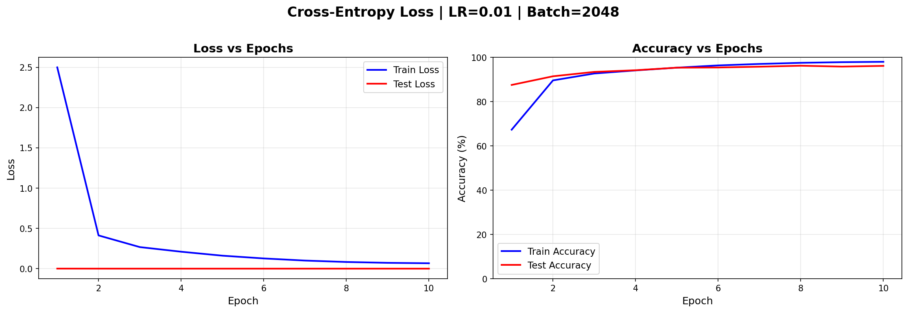

*Training curves showing: Left = Loss (train/test), Right = Accuracy (train/test)*

#### — - 10 epochs (✅ Success)

**Best Test Accuracy**: 95.64%

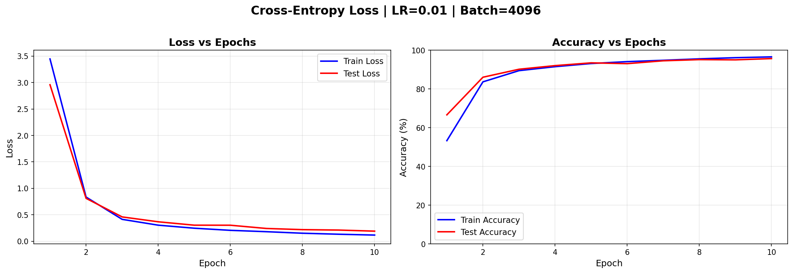

*Training curves showing: Left = Loss (train/test), Right = Accuracy (train/test)*

### Hinge Loss

#### margin=1.0 - 20 epochs (✅ Success)

**Best Test Accuracy**: 96.86%

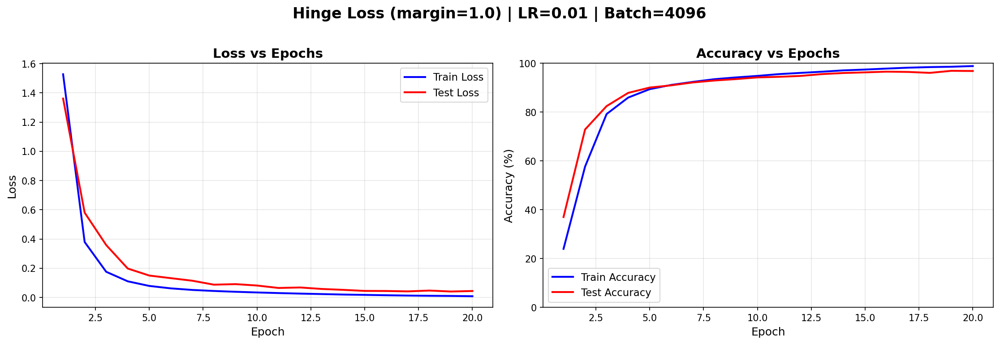

*Training curves showing: Left = Loss (train/test), Right = Accuracy (train/test)*

#### margin=1.0 - 10 epochs (✅ Success)

**Best Test Accuracy**: 94.16%

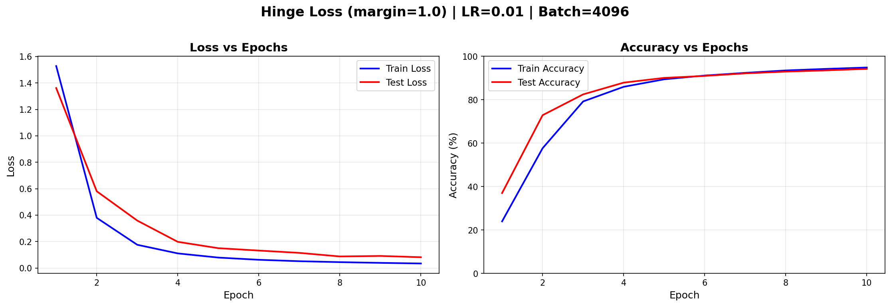

*Training curves showing: Left = Loss (train/test), Right = Accuracy (train/test)*

### Hinge + b-Annealing

#### margin=1.0, b: 1.0 -> 100.0 - 20 epochs (❌ FAILED)

**Best Test Accuracy**: 87.01%

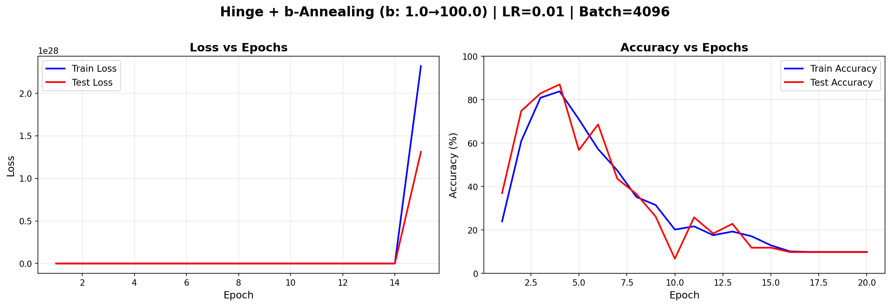

*Training curves showing: Left = Loss (train/test), Right = Accuracy (train/test)*

#### margin=1.0, b: 1.0 -> 100.0 - 10 epochs (❌ FAILED)

**Best Test Accuracy**: 77.11%

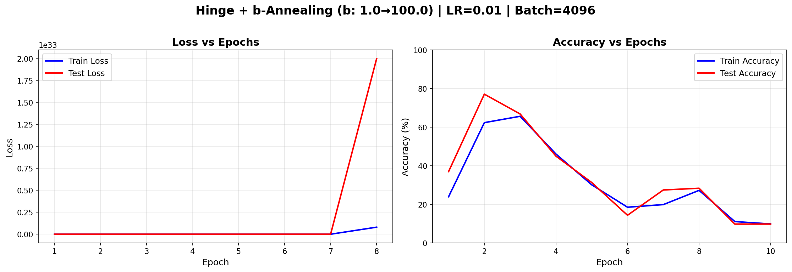

*Training curves showing: Left = Loss (train/test), Right = Accuracy (train/test)*

### Hinge + β-Annealing

#### margin=1.0, β: 0.5 -> 5.0 - 20 epochs (✅ Success)

**Best Test Accuracy**: 97.05%

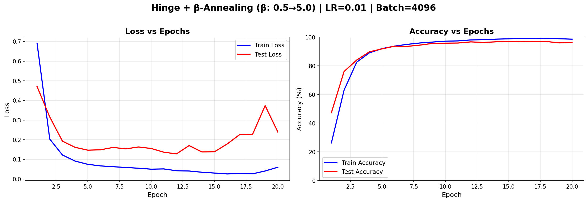

*Training curves showing: Left = Loss (train/test), Right = Accuracy (train/test)*

#### margin=1.0, β: 0.5 -> 5.0 - 10 epochs (✅ Success)

**Best Test Accuracy**: 95.83%

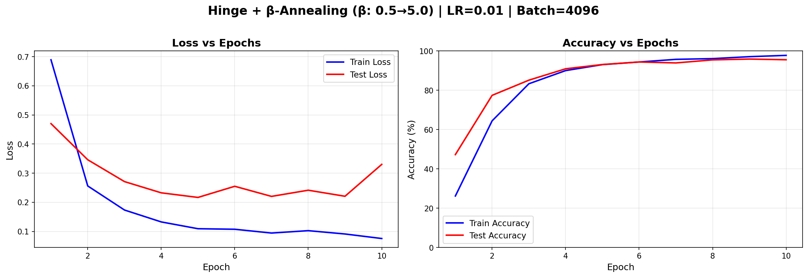

*Training curves showing: Left = Loss (train/test), Right = Accuracy (train/test)*

### Hinge + Both Annealing

#### margin=1.0, b: 1.0 -> 100.0, β: 0.5 -> 5.0 - 20 epochs (❌ FAILED)

**Best Test Accuracy**: 81.72%

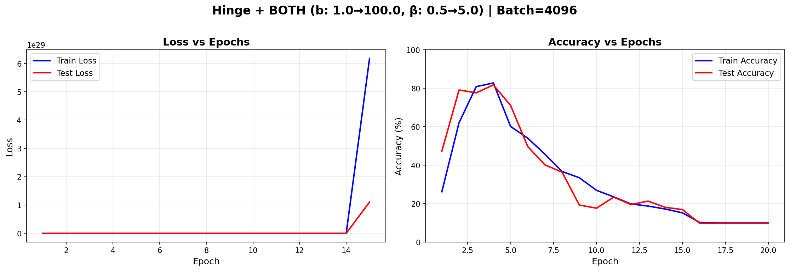

*Training curves showing: Left = Loss (train/test), Right = Accuracy (train/test)*

#### margin=1.0, b: 1.0 -> 100.0, β: 0.5 -> 5.0 - 10 epochs (❌ FAILED)

**Best Test Accuracy**: 79.90%

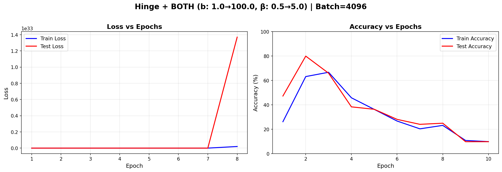

*Training curves showing: Left = Loss (train/test), Right = Accuracy (train/test)*

### Vlog + β-Annealing

#### b=5.0, β: 0.5 -> 5.0 - 20 epochs (✅ Success)

**Best Test Accuracy**: 97.59%

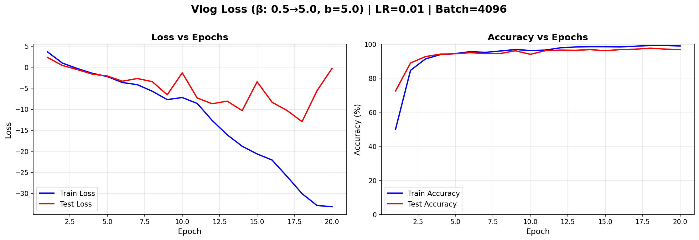

*Training curves showing: Left = Loss (train/test), Right = Accuracy (train/test)*

#### b=5.0, β: 0.5 -> 100.0 - 20 epochs (✅ Success)

**Best Test Accuracy**: 97.28%

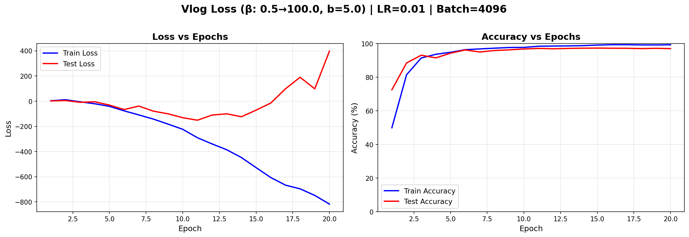

*Training curves showing: Left = Loss (train/test), Right = Accuracy (train/test)*

#### b=5.0, β: 0.5 -> 100.0 - 10 epochs (✅ Success)

**Best Test Accuracy**: 96.74%

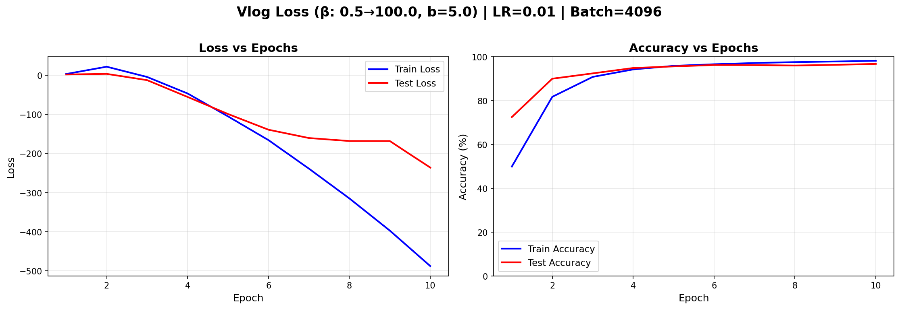

*Training curves showing: Left = Loss (train/test), Right = Accuracy (train/test)*

#### b=5.0, β: 0.5 -> 5.0 - 10 epochs (✅ Success)

**Best Test Accuracy**: 96.70%

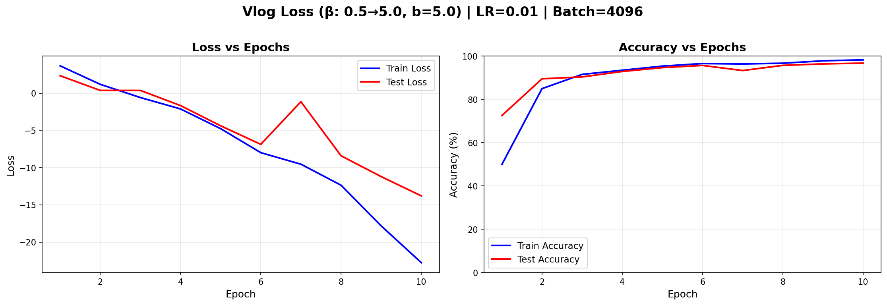

*Training curves showing: Left = Loss (train/test), Right = Accuracy (train/test)*

### Vlog (Fixed)

#### b=2.0, β=1.0 - 10 epochs (✅ Success)

**Best Test Accuracy**: 97.57%

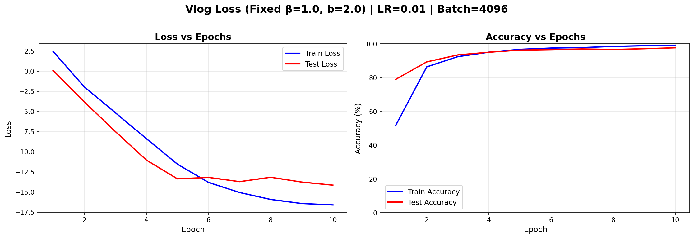

*Training curves showing: Left = Loss (train/test), Right = Accuracy (train/test)*

#### b=1.0, β=1.0 - 10 epochs (✅ Success)

**Best Test Accuracy**: 97.24%

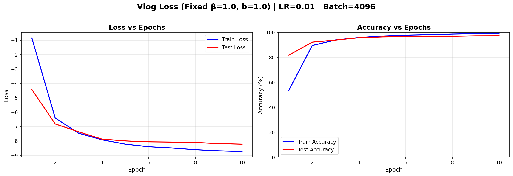

*Training curves showing: Left = Loss (train/test), Right = Accuracy (train/test)*

#### b=5.0, β=1.0 - 10 epochs (✅ Success)

**Best Test Accuracy**: 96.06%

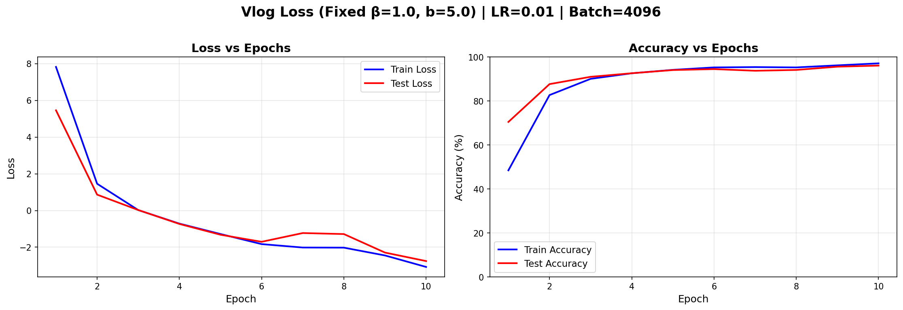

*Training curves showing: Left = Loss (train/test), Right = Accuracy (train/test)*

#### b=10.0, β=1.0 - 10 epochs (✅ Success)

**Best Test Accuracy**: 94.67%

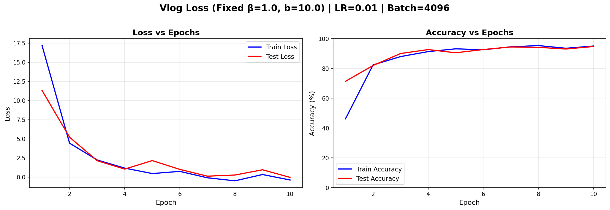

*Training curves showing: Left = Loss (train/test), Right = Accuracy (train/test)*

#### b=20.0, β=1.0 - 10 epochs (✅ Success)

**Best Test Accuracy**: 93.33%

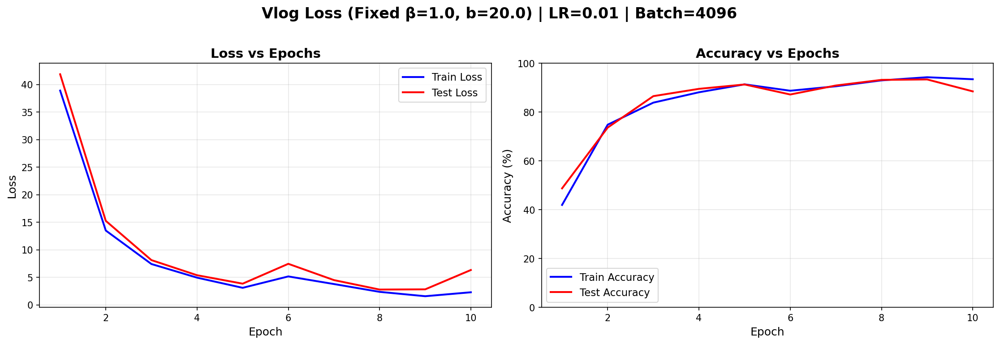

*Training curves showing: Left = Loss (train/test), Right = Accuracy (train/test)*

---

## 🎯 Recommendations

Based on the experimental results:

### ✅ What Works Well

1. **Vlog Loss with low b values** (b=1.0 to 5.0): Consistently high performance
2. **β-Annealing** (temperature annealing): Improves convergence for both Hinge and Vlog
3. **Batch size 4096**: Good balance between speed and stability

### ❌ What to Avoid

1. **b-Annealing alone** (1.0 → 100.0): Causes catastrophic loss explosion
2. **High b values** (b=20.0): Unstable training and poor convergence
3. **Combining b and β annealing**: Compounds instability issues

### 🚀 Suggested Next Steps

1. **Focus on Vlog + β-annealing**: Most promising approach
2. **Test intermediate β ranges**: Try β: 0.5 → 10.0 or 1.0 → 20.0
3. **Longer training**: Run best configs for 50-100 epochs
4. **Add gradient clipping**: May enable stable b-annealing

---

*Report generated automatically by `analyze_all_results.py`*
