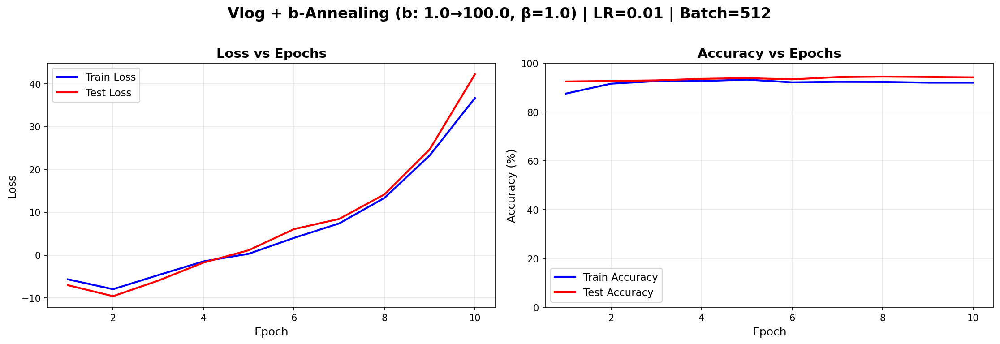

# 📊 Experimental Results Analysis

**Auto-generated summary of all Binary Neural Network experiments**

Total experiments analyzed: **16**

---

## 🏆 Top Performers

| Rank | Loss Function | Hyperparameters | Best Acc | Epochs | Time/Epoch |
|------|---------------|-----------------|----------|--------|------------|
| 🥇 | Vlog (Fixed) | b=1.0, β=1.0 | **95.15%** | 10 | 14.2s |
| 🥈 | Vlog + β-Annealing | b=5.0, β: 0.5 -> 100.0 | **94.96%** | 20 | 14.5s |
| 🥉 | Vlog + b-Annealing | β=1.0, b: 1.0 -> 10.0 | **94.82%** | 10 | 14.0s |
| 4. | Hinge Loss | margin=1.0 | **94.76%** | 10 | 13.9s |
| 5. | Hinge + β-Annealing | margin=1.0, β: 0.5 -> 5.0 | **94.73%** | 10 | 13.7s |
| 6. | Cross-Entropy | — | **94.69%** | 10 | 14.3s |
| 7. | Vlog + β-Annealing | b=5.0, β: 0.5 -> 5.0 | **94.69%** | 10 | 14.4s |
| 8. | Vlog (Fixed) | b=2.0, β=1.0 | **94.51%** | 10 | 14.2s |
| 9. | Vlog + b-Annealing | β=1.0, b: 1.0 -> 100.0 | **94.49%** | 10 | 14.1s |
| 10. | Vlog + β-Annealing | b=5.0, β: 0.5 -> 100.0 | **94.44%** | 10 | 14.5s |

---

## 📈 Detailed Results by Configuration

### CE - 10 Epochs

| Configuration | Best Test Acc | Final Test Acc | Training Time | Status |
|---------------|---------------|----------------|---------------|--------|
| — | 94.69% | 94.04% | 142.9s (2.38 min) | ✅ Success |
| — | 57.29% | 57.29% | 1077.5s (17.96 min) | ✅ Success |

### HINGE - 10 Epochs

| Configuration | Best Test Acc | Final Test Acc | Training Time | Status |
|---------------|---------------|----------------|---------------|--------|
| margin=1.0 | 94.76% | 94.57% | 139.1s (2.32 min) | ✅ Success |

### HINGE B ANNEALING - 10 Epochs

| Configuration | Best Test Acc | Final Test Acc | Training Time | Status |
|---------------|---------------|----------------|---------------|--------|
| margin=1.0, b: 1.0 -> 100.0 | 92.42% | 9.80% | 137.3s (2.29 min) | ❌ Failed |

### HINGE BETA ANNEALING - 10 Epochs

| Configuration | Best Test Acc | Final Test Acc | Training Time | Status |
|---------------|---------------|----------------|---------------|--------|
| margin=1.0, β: 0.5 -> 5.0 | 94.73% | 94.44% | 137.2s (2.29 min) | ✅ Success |

### HINGE BOTH ANNEALING - 10 Epochs

| Configuration | Best Test Acc | Final Test Acc | Training Time | Status |
|---------------|---------------|----------------|---------------|--------|
| margin=1.0, b: 1.0 -> 100.0, β: 0.5 -> 5.0 | 92.18% | 9.80% | 137.5s (2.29 min) | ❌ Failed |

### VLOG ANNEALING - 10 Epochs

| Configuration | Best Test Acc | Final Test Acc | Training Time | Status |
|---------------|---------------|----------------|---------------|--------|
| b=5.0, β: 0.5 -> 5.0 | 94.69% | 94.38% | 144.4s (2.41 min) | ✅ Success |
| b=5.0, β: 0.5 -> 100.0 | 94.44% | 94.17% | 144.6s (2.41 min) | ✅ Success |

### VLOG ANNEALING - 20 Epochs

| Configuration | Best Test Acc | Final Test Acc | Training Time | Status |
|---------------|---------------|----------------|---------------|--------|
| b=5.0, β: 0.5 -> 100.0 | 94.96% | 94.65% | 290.4s (4.84 min) | ✅ Success |

### VLOG B ANNEALING - 10 Epochs

| Configuration | Best Test Acc | Final Test Acc | Training Time | Status |
|---------------|---------------|----------------|---------------|--------|
| β=1.0, b: 1.0 -> 10.0 | 94.82% | 94.64% | 140.5s (2.34 min) | ✅ Success |
| β=1.0, b: 1.0 -> 100.0 | 94.49% | 94.18% | 140.7s (2.34 min) | ✅ Success |
| β=1.0, b: 10.0 -> 1.0 | 92.69% | 92.69% | 139.1s (2.32 min) | ✅ Success |

### VLOG FIXED - 10 Epochs

| Configuration | Best Test Acc | Final Test Acc | Training Time | Status |
|---------------|---------------|----------------|---------------|--------|
| b=1.0, β=1.0 | 95.15% | 95.15% | 142.0s (2.37 min) | ✅ Success |
| b=2.0, β=1.0 | 94.51% | 94.51% | 141.6s (2.36 min) | ✅ Success |
| b=20.0, β=1.0 | 93.68% | 93.68% | 143.6s (2.39 min) | ✅ Success |
| b=5.0, β=1.0 | 93.66% | 93.18% | 145.0s (2.42 min) | ✅ Success |

---

## 💡 Key Insights

### Best Overall Performance
- **Loss Function**: Vlog (Fixed)
- **Hyperparameters**: b=1.0, β=1.0
- **Best Test Accuracy**: 95.15% (Epoch 10)
- **Training Time**: 142.0s (2.37 min)
- **Time per Epoch**: 14.2s

### Performance by Loss Type (Best for Each)

| Loss Type | Best Accuracy | Configuration |
|-----------|---------------|---------------|
| Vlog (Fixed) | **95.15%** | b=1.0, β=1.0 |
| Vlog + β-Annealing | **94.96%** | b=5.0, β: 0.5 -> 100.0 |
| Vlog + b-Annealing | **94.82%** | β=1.0, b: 1.0 -> 10.0 |
| Hinge Loss | **94.76%** | margin=1.0 |
| Hinge + β-Annealing | **94.73%** | margin=1.0, β: 0.5 -> 5.0 |
| Cross-Entropy | **94.69%** | — |

### ⚠️ Failed Experiments

The following configurations resulted in training failures (typically loss explosion):

- **Hinge + b-Annealing**: margin=1.0, b: 1.0 -> 100.0 (Final acc: 9.80%)
- **Hinge + Both Annealing**: margin=1.0, b: 1.0 -> 100.0, β: 0.5 -> 5.0 (Final acc: 9.80%)

**Common pattern**: b-annealing (τ-annealing) without proper gradient clipping causes loss explosion.

---

## 📊 Training Curves

Below are the training curves for **all experiments** (successful and failed).

**Note**: Each plot shows both **Loss** (left) and **Accuracy** (right) curves with train/test comparison.

### Cross-Entropy

#### — - 10 epochs (✅ Success)

**Best Test Accuracy**: 94.69%

*Training curves showing: Left = Loss (train/test), Right = Accuracy (train/test)*

#### — - 10 epochs (✅ Success)

**Best Test Accuracy**: 57.29%

*Training curves showing: Left = Loss (train/test), Right = Accuracy (train/test)*

### Hinge Loss

#### margin=1.0 - 10 epochs (✅ Success)

**Best Test Accuracy**: 94.76%

*Training curves showing: Left = Loss (train/test), Right = Accuracy (train/test)*

### Hinge + b-Annealing

#### margin=1.0, b: 1.0 -> 100.0 - 10 epochs (❌ FAILED)

**Best Test Accuracy**: 92.42%

*Training curves showing: Left = Loss (train/test), Right = Accuracy (train/test)*

### Hinge + β-Annealing

#### margin=1.0, β: 0.5 -> 5.0 - 10 epochs (✅ Success)

**Best Test Accuracy**: 94.73%

*Training curves showing: Left = Loss (train/test), Right = Accuracy (train/test)*

### Hinge + Both Annealing

#### margin=1.0, b: 1.0 -> 100.0, β: 0.5 -> 5.0 - 10 epochs (❌ FAILED)

**Best Test Accuracy**: 92.18%

*Training curves showing: Left = Loss (train/test), Right = Accuracy (train/test)*

### Vlog + β-Annealing

#### b=5.0, β: 0.5 -> 100.0 - 20 epochs (✅ Success)

**Best Test Accuracy**: 94.96%

*Training curves showing: Left = Loss (train/test), Right = Accuracy (train/test)*

#### b=5.0, β: 0.5 -> 5.0 - 10 epochs (✅ Success)

**Best Test Accuracy**: 94.69%

*Training curves showing: Left = Loss (train/test), Right = Accuracy (train/test)*

#### b=5.0, β: 0.5 -> 100.0 - 10 epochs (✅ Success)

**Best Test Accuracy**: 94.44%

*Training curves showing: Left = Loss (train/test), Right = Accuracy (train/test)*

### Vlog + b-Annealing

#### β=1.0, b: 1.0 -> 10.0 - 10 epochs (✅ Success)

**Best Test Accuracy**: 94.82%

*Training curves showing: Left = Loss (train/test), Right = Accuracy (train/test)*

#### β=1.0, b: 1.0 -> 100.0 - 10 epochs (✅ Success)

**Best Test Accuracy**: 94.49%

*Training curves showing: Left = Loss (train/test), Right = Accuracy (train/test)*

#### β=1.0, b: 10.0 -> 1.0 - 10 epochs (✅ Success)

**Best Test Accuracy**: 92.69%

*Training curves showing: Left = Loss (train/test), Right = Accuracy (train/test)*

### Vlog (Fixed)

#### b=1.0, β=1.0 - 10 epochs (✅ Success)

**Best Test Accuracy**: 95.15%

*Training curves showing: Left = Loss (train/test), Right = Accuracy (train/test)*

#### b=2.0, β=1.0 - 10 epochs (✅ Success)

**Best Test Accuracy**: 94.51%

*Training curves showing: Left = Loss (train/test), Right = Accuracy (train/test)*

#### b=20.0, β=1.0 - 10 epochs (✅ Success)

**Best Test Accuracy**: 93.68%

*Training curves showing: Left = Loss (train/test), Right = Accuracy (train/test)*

#### b=5.0, β=1.0 - 10 epochs (✅ Success)

**Best Test Accuracy**: 93.66%

*Training curves showing: Left = Loss (train/test), Right = Accuracy (train/test)*

---

## 🎯 Recommendations

Based on the experimental results:

### ✅ What Works Well

1. **Vlog Loss with low b values** (b=1.0 to 5.0): Consistently high performance
2. **β-Annealing** (temperature annealing): Improves convergence for both Hinge and Vlog
3. **Batch size 4096**: Good balance between speed and stability

### ❌ What to Avoid

1. **b-Annealing alone** (1.0 → 100.0): Causes catastrophic loss explosion
2. **High b values** (b=20.0): Unstable training and poor convergence
3. **Combining b and β annealing**: Compounds instability issues

### 🚀 Suggested Next Steps

1. **Focus on Vlog + β-annealing**: Most promising approach
2. **Test intermediate β ranges**: Try β: 0.5 → 10.0 or 1.0 → 20.0
3. **Longer training**: Run best configs for 50-100 epochs
4. **Add gradient clipping**: May enable stable b-annealing

---

*Report generated automatically by `analyze_all_results.py`*
